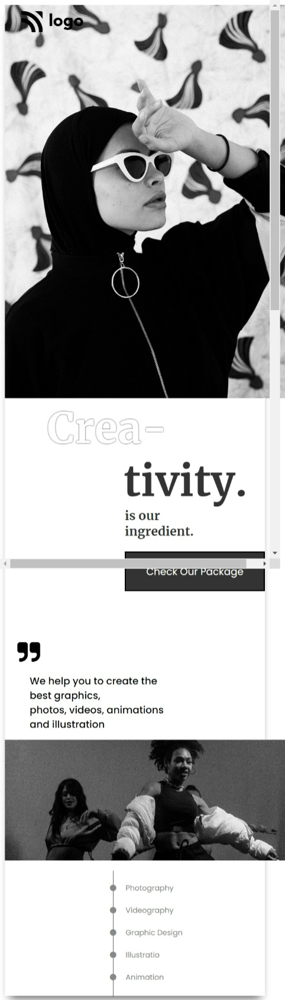
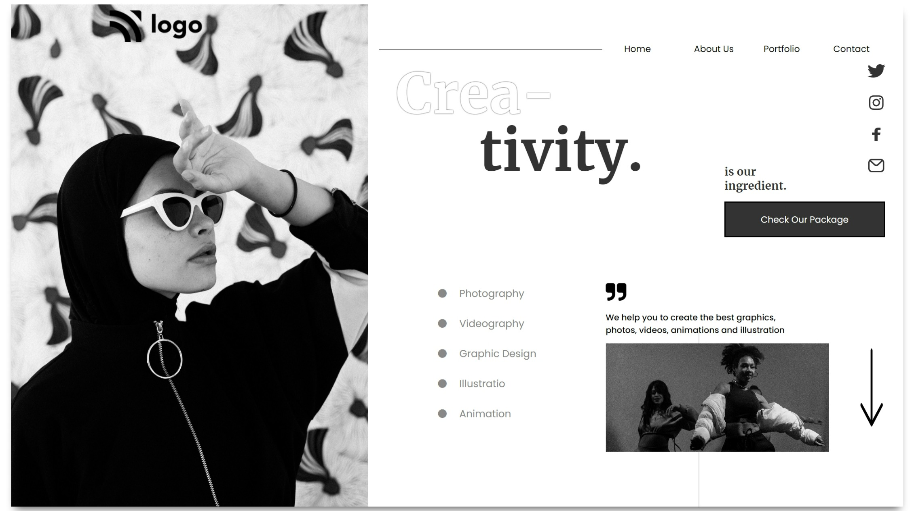

# 
**Project 14 - Food Restaurant Home Page**

> ## Topics learnt in this project
- object alignment placement understanding in better way
- working with nested 
 structure  to arrange componenet properly.
- Plan to write html for such complex structure
   

> ## Time to complete this project 
> # **6 Hrs**

## **By : Kalpesh K Dhotre**
 

## [🌏 Deployed link](https://kd-project-14.netlify.app/)

 

## Below is screenshot of Mobile View & [Click here large screen view.](#large-screen-view)

 

 

# Large Screen View

 

## 
 [Back to top](#centerproject-14---food-restaurant-home-pagecenter)
